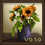

# 

 Adds a set of hand-made paintings to the vanilla painting block so you can brighten up your builds without adding new blocks or shapes.

These pixel paintings are unique and created by myself.  They are meant to work well in both vanilla and modded Vintage Story games, and I tried to go for a mix of vibrant colors and familiar subjects to convey that, in the past, the present and future used to be much brighter.  

I will be adding continuously to this mod and have in-progress updates to add multiple canvas/art sizes and types.  

I also take requests so if you have an idea for a painting you'd like to see in the mod, [let me know](https://github.com/mizziness/VintageGallery/issues)!

## Content

- 13 new painting variants: Aurora, Beach, Cattails, Dunes, Fish, Forest, Fox, Hills, Lilypads, Mountain, Raccoon, Sunflowers, Sunset.
- Integrates directly into the vanilla painting block via [assets/vintagegallery/patches/painting-variants.json](assets/vintagegallery/patches/painting-variants.json) and the existing painting crafting/placement flow.

<table align="center">
  <tr>
    <td align="center">
       
      Aurora
    </td>
    <td align="center">
       
      Beach
    </td>
    <td align="center">
       
      Cattails
    </td>
    <td align="center">
       
      Dunes
    </td>
    <td align="center">
       
      Fish
    </td>
    <td align="center">
       
      Forest
    </td>
    <td align="center">
       
      Fox
    </td>
  </tr>
</table>

<table align="center">
  <tr>
    <td align="center">
       
      Hills
    </td>
    <td align="center">
       
      Lilypads
    </td>
    <td align="center">
       
      Mountains
    </td>
    <td align="center">
       
      Raccoon
    </td>
    <td align="center">
       
      Sunflowers
    </td>
    <td align="center">
       
      Sunset
    </td>
  </tr>
</table>

## How to get the paintings
- Vanilla traders: artisan, villager-wall, luxuries, and furniture traders can sell (and some buy) the new paintings as patched in [assets/vintagegallery/patches/traders.json](assets/vintagegallery/patches/traders.json).
- Better Ruins (optional): paintings can appear in cursed loot tables when the mod is present; guarded with a file-exists condition in [assets/vintagegallery/patches/betterruins.json](assets/vintagegallery/patches/betterruins.json).
- Tradie (optional): the Tradie Painter sells the full set when the mod is loaded, via [assets/vintagegallery/patches/tradie.json](assets/vintagegallery/patches/tradie.json).
- Otherwise, craft/place the standard painting block to roll any vanilla or Vintage Gallery variant.

## Compatibility notes
- Patch-only mod; no vanilla assets are replaced, and optional integrations are conditionally applied so missing mods will not log warnings.
- Safe for servers/clients; clients need the mod for textures and names.

## Installation
1) Download the latest release (or the release of your choice) and drop it into your `VintagestoryData/Mods` directory.
2) Launch or restart the game. Load order can be anywhere; place after [Better Ruins](https://mods.vintagestory.at/betterruins) or [Traders Expansion (Tradie)](https://mods.vintagestory.at/tradie) if using those integrations.

## Credits
Pixel paintings and mod by Evalynn.

## Links & contact
- Mod Page: https://mods.vintagestory.at/vintagegallery
- Discord:  [Evalynn](https://discord.com/users/179243675950383104)
- GitHub/Issues: [https://github.com/mizziness/VintageGallery](https://github.com/mizziness/VintageGallery)
- Evalynn's Linktree: [https://linktr.ee/craftywaifu](https://linktr.ee/craftywaifu)
